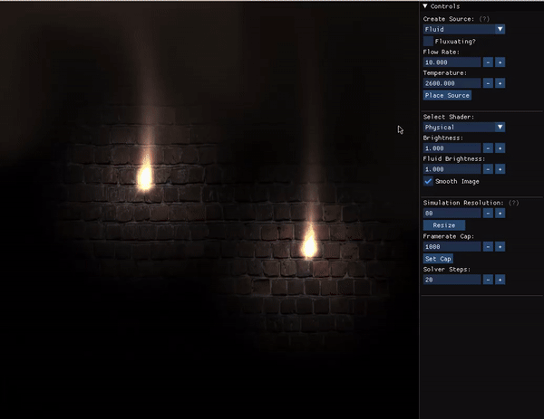

# Interactive Rendering of Fire and Smoke Dynamics  
Fluid Simulation in C++ and OpenGL by Suh Yoon Jeon and Hyesung Jeon


*demo part 1: click to start the video*

## Execution

Our project is designed for Linux systems and has been tested on Ubuntu.

### Dependencies

The following libraries are required to build and run the simulator:

- **GLFW**  
- **GLEW**  

Install the dependencies with the following commands:

```bash
sudo apt update && sudo apt upgrade
sudo apt install build-essential cmake git libglfw3-dev libglew-dev
```

### Build and Execute

To build and execute the simulator, run the following commands:

```bash
mkdir build && cd build
cmake ../
make
../bin/FluidSimGUI
```

As demonstrated in the video above, you can initiate fires using the 'Place Source' feature. By dragging the mouse, the fire can be moved around before its final placement.

Additionally, the simulator supports multiple rendering modes, including:

* **Rendering Modes**
  * Physical: Full rendering of fire and smoke dynamics
  * Blackbody: Rendering the blackbody radiation effect
  * Density: Displaying fluid density
  * Temperature: Visualizing temperature distribution

These rendering modes are showcased in the demo video below.



*demo part 2: click to start the video*

## Explanation

This simulator models 2D fluid dynamics involving the interaction of mixed fluids. It simulates various phenomena, including:

* **Fire and Smokes Dynamics**
  * Convection and advection using the Navier-Stokes equations
  * Molecular diffusion following Fick's law
  * Thermal diffusion based on Fourier's law
  * Buoyancy effects driven by density and thermal variations
  * Blackbody effects
    
* **Realistic Real-time Rendering**
  * Lighting
  * Background Texture
  * Low-resolution Solver with High-resolution Rendering
  
* **Interactive features**
  * Initialization
  * Multiple fires
  * Wind
  * Multiple Rendering Modes via Shaders

The implementation is inspired by the techniques described in "Real-Time Fluid Dynamics for Games" (Stam, 2003) and other references on fluid simulation. Note that our approach does not use the smoothed-particle hydrodynamics (SPH) method.
